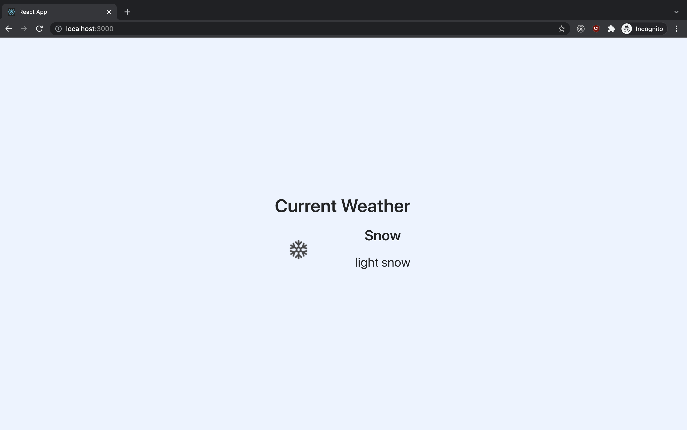
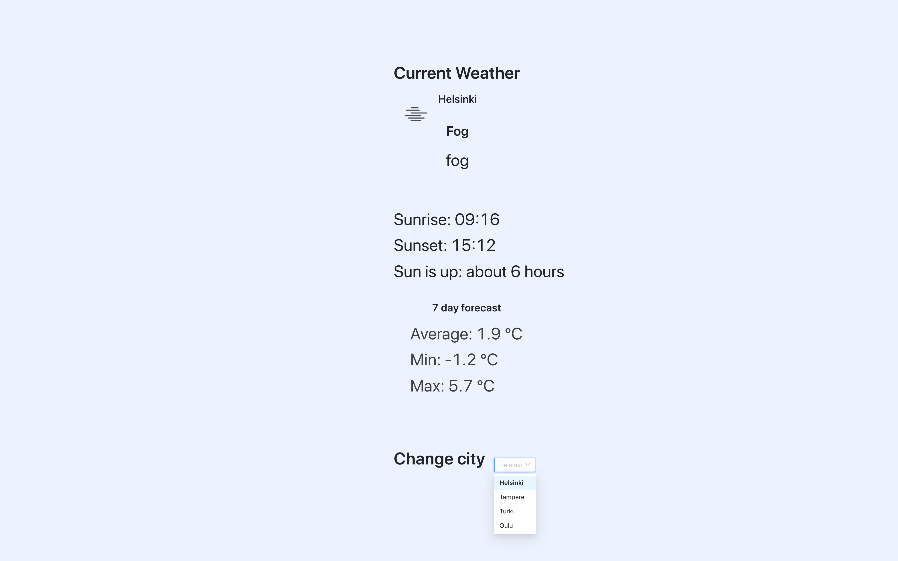

# Aatos Coding Challennge

## Libraries/tech used

You don't need to know all of these beforehand, we've tried to keep things simple enough to be found from the documentation easily.

- [React](https://reactjs.org/), using React [Hooks API](https://reactjs.org/docs/hooks-intro.html)
- [TypeScript](https://www.typescriptlang.org/docs/)
- [Ant Design](https://ant.design/components/overview/)

## Prerequisites

* An [openweathermap](http://openweathermap.org/) API key.

Create an account to openweathermap.org (it's free) and create an API key. Create a file called `.env.development.local` in the root directory

with the following content (add your own api key)

```
REACT_APP_API_KEY=your-api-key-here
```

You may read more about the usage of `.env.development.local` from [here](https://create-react-app.dev/docs/adding-custom-environment-variables/) if interested, but basically it allows you to create environment variables that are evaluated and embedded at the build time (i.e. when you run `yarn start`).

## Running the project

Install dependencies
```
yarn
# or 
npm install
```
Run project
```
yarn start
# or
npm run start
```


## The Challenge

### 1. Make it compile

Something seems off... Find what is causing the application to crash on start

### 2. Where's the data?

At the moment there's no data to show. Use the provided `getWeatherFromApi` function and fetch the weather data when the `Weather` component is mounted the first time.

**IMPORTANT NOTE:** The OpenWeatherMap API has a limit of 60 requests per minute. Be careful not to accidentally make an infinite loop that spams the API so your OpenWeatherMap account won't get blocked. If your account gets blocked, you won't be able to make any more requests. If that happens, you have to make a new account and update your API key in `.env.development.local` and restart the project.

### 3. Add some columns

We'll be using a design system called Antd Design. Use Ant Design's Grid system to modify the view to show data in two columns (example below)

Hints:
* [Ant Design Documentation](https://ant.design/components/overview/)




### 4. WeatherDataSection deserves it's own file

WeatherDataSection deserves it's own file: Move the component to a new file and import it from there.


### 5. Possibility select the city

At the moment we're always getting the current Weather data for Helsinki. Add a way for the user to select a city from the following options:

* Helsinki
* Tampere
* Turku
* Oulu

The weather data should automatically be updated with the data for the chosen city

Also, the chosen city should be passed to the WeatherDataSection component as a prop and it should show the city name.

### 6. Sunrise and sunset

The same api call that we use to get the current weather also gives us information regarding sunset and sunrise. Using this data, create a new component that informs the user what time the sunsets and rises, and how long the day is ( i.e. difference between sunset and sunrise, you can decide how precise you'd like to show this information). You may use an external npm library to date/time calculations (for example: [date-fns](https://date-fns.org/)).

Hint: The api returns the sunrise and sunset data in unix time. In order to convert it to a Javascript Date object you need to multiply it with 1000 e.g. `new Date(sunrise * 1000)`;


### 7. Show the weather forecast

Use the provided `getWeatherForecast` function to fetch the 7 day weather forecast for the given city. Show the following information regarding the forecast:

* Minimum temperature
* Maximum temperature
* Average temperature

The temperatures should be shown up to a precision of 1 decimal, so for example -1.9031 would be shown as -1.9. To get the temperature for a given day, you can use the `getTemperatureForDay` to parse it from an object in the forecast array.

## The final result

The final result should look something like this



Feel free to make it prettier than the example if you want :)

## Available Scripts

In the project directory, you can run:

### `yarn start`

Runs the app in the development mode.\
Open [http://localhost:3000](http://localhost:3000) to view it in the browser.

The page will reload if you make edits.\
You will also see any lint errors in the console.
